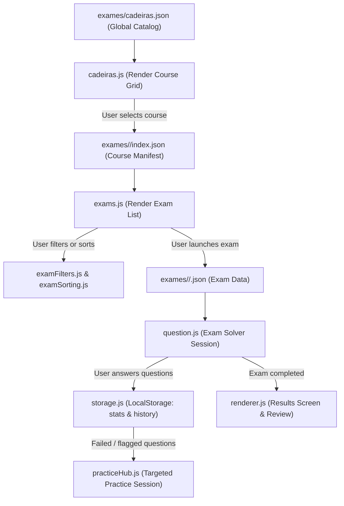

# Codebase Map

## At a Glance

This repository contains a high-performance, responsive, static web application for exam simulation and study, served directly via GitHub Pages with zero runtime backend dependencies. The user interface is a client-side Single Page Application (SPA) driven by native ES modules. Exam and course data are stored in structured JSON files under `exames/`. 

Local development, index generation, and data integrity verification are orchestrated via `run.py` using Python standard library tooling. The application is built with strict privacy compliance (zero external network dependencies, local self-hosted fonts) and adheres to WCAG 2.1 AA / EAA 2025 accessibility standards.

---

## Repository Layout

| Path | Purpose |
| --- | --- |
| `index.html` | Application HTML skeleton, persistent top bars, screen sections, modal dialogs, and ES module entry point (`static/js/main.js`). |
| `static/` | Static frontend assets. |
| `static/style.css` | Primary stylesheet: resets, typography, floating 3-column layout, split solver, animations, and responsive breakpoints. |
| `static/colors.css` | CSS color design tokens (monochromatic slate/black aesthetic with purple/amber/emerald semantic accents). |
| `static/typography.css` | Typography definitions and font-family declarations. |
| `static/menu.css` | Navigation menus, custom dropdowns, and button styles. |
| `static/fonts/` | Local self-hosted WOFF/WOFF2 font files (`Share Tech Mono`, `JetBrains Mono`, `Inter`). |
| `static/js/` | Client-side application logic split into focused ES modules. |
| `exames/` | Course and exam content storage. |
| `exames/cadeiras.json` | Generated global catalog listing all system courses (`adi`, `ssi`, `tso`). |
| `exames/<course-id>/cadeira.json` | Metadata for a specific course (display title, sigla, icon, description). |
| `exames/<course-id>/*.json` | Individual exam files holding question collections, answers, explanations, and configurations. |
| `exames/<course-id>/index.json` | Generated course manifest listing available exams and question count summaries. |
| `tests/` | Python `unittest` suite testing index generation, data integrity, and frontend module contracts. |
| `run.py` | Local development CLI: dev server (`:5000`), index compilation (`--build-only`), schema validator (`--validate`), and starter generator (`--new-exam`). |
| `FORMATO_PERGUNTAS.md` | Reference specification for supported question types (`escolha_multipla`, `boolean`, `escrita`) and solution indexing. |
| `HOW_TO_USE.md` | Guide for course creation, exam authoring, and question structure. |
| `AGENTS.md` | Repository guidelines, coding style, test rules, and pull request conventions. |
| `scripts/`, `scratch/`, `debug_tools/`, `Test/` | Ad hoc tools and development aids (`Test/` is git-ignored). |

---

## Responsive Layout System & Geometry

The application uses an exact mathematical layout system to guarantee symmetrical proportions across standard 1080p desktop monitors, scaled Windows displays (125% and 150% DPI zoom), laptops (1440×900, 1366×768), tablets, and mobile devices.

### 1. Typography & Base Rem Scaling (`html`)
Base root font size scales responsively across viewport widths, ensuring consistent proportions for all `rem` values:
- `≥ 1600px` (Native 1080p / 1440p): `19.2px` (generous 120% scale for comfortable readability)
- `1200px – 1600px` (Laptops & 125% DPI scale): `16.5px`
- `768px – 1200px` (Tablets & 150% DPI scale): `15px`
- `< 768px` (Mobile devices): `14px`

### 2. 3-Column Floating Screen Layout (`#screen-cadeiras`, `#screen-menu`)
The catalog screens use a central column bounded by two floating sidebars:
- **Center Column** (`.exams-main-column` / `.exams-screen-layout`):
  - `≥ 1600px`: `--menu-center-width: 1032px`
  - `1360px – 1600px`: `--menu-center-width: 880px`
  - `1080px – 1360px`: `--menu-center-width: 740px`
- **Left Sidebar** (`.floating-filters-sidebar`):
  Contains search, sorting, question type, and score filters.
- **Right Sidebar** (`.floating-practice-sidebar`):
  Contains quick-launch practice session triggers ("Praticar Difíceis" / "Praticar Erradas").
- **Layout Symmetry in `#screen-cadeiras`**:
  `#screen-cadeiras` includes an invisible spacer (`aside.floating-practice-sidebar.floating-cadeiras-spacer`) balancing the right gutter identically to `#screen-menu`. This ensures the course grid remains strictly centered with equal lateral margins on both sides:
  $$\text{Margin}_{\text{lateral}} = \frac{W_{\text{viewport}} - W_{\text{center}}}{2}$$
- **Floating Margin Formula**:
  $$\text{margin-left} = \text{calc}(-25\text{vw} + 25\% - \text{half-width} + \text{adjust})$$
  This centers the sidebar within the lateral gutter. A matching negative opposite margin (`margin-right: calc(-1 * width)`) prevents the floated element from displacing the centered content flow.
- **Breakpoints**:
  - `≥ 1080px`: Sidebars float laterally beside the center column; exams start immediately at the top without vertical displacement.
  - `< 1080px`: Sidebars stack inline above the content. The practice hub collapses into a compact horizontal 38px button strip, and filters wrap cleanly into a compact row, preventing excessive vertical space before exams.

### 3. Unified Sticky Sub-Header
The sub-header (`.sticky-menu-header-wrapper`) provides a blur-backed bar that docks smoothly on scroll:
- **Vertical Centering Math**:
  - Wrapper has `padding-top: 1.0rem`, `margin-top: -1.0rem`, and `margin-bottom: 0.59rem`.
  - Header items (`.sticky-header-center`, `.sticky-header-left`, `.sticky-header-right`) have `height: 36px`, `box-sizing: content-box`, and bottom spacing `padding: 0 0 1.0rem 0`.
  - Content ($36\text{px}$) is centered between the top padding ($1.0\text{rem}$) and bottom padding ($1.0\text{rem}$), terminating at the bottom divider `border-bottom: 1px solid rgba(255, 255, 255, 0.08)`.
- **Corner Badges**:
  `.sticky-corner-left` (mini course icon) and `.sticky-corner-right` (settings shortcut) anchor cleanly inside the lateral slots on screens `< 1720px`, preventing off-screen overflow.

### 4. Exam Solver Screen (`#screen-exam`)
- **Split-Pane Layout**:
  Displays questions and scenarios on the left (`.exam-left-pane`), and answer choices, feedback, and solution justifications on the right (`.exam-right-pane`).
- **Optical Baseline Spacer** (`.pane-top-spacer`):
  Uses `flex: 0 0 clamp(6px, 1.2vh, 16px)` and `height: clamp(6px, 1.2vh, 16px)`, avoiding empty space at the top of question panes.
- **Docked Navigation Controls**:
  - On desktop, controls sit at the bottom of each respective pane.
  - On screens `≤ 960px`, `.exam-right-controls` docks as a sticky footer (`position: sticky; bottom: 0; background: rgba(15, 15, 17, 0.96); backdrop-filter: blur(12px)`) so that "Anterior" and "Seguinte" remain visible without scrolling past long option sets.

---

## Browser ES Modules Architecture

Browser logic is modularized under `static/js/`:

```
static/js/
├── main.js                  # Application bootstrapper and lifecycle coordinator
├── elements.js              # Centralized DOM selector getters
├── events.js                # Core event listener wiring
├── navigation.js            # Screen transitions and state routing
├── state.js                 # Global reactive application state
├── constants.js             # Magic strings, configuration constants, storage keys
├── config.js                # Default settings and feature flags
├── utils.js                 # DOM helpers, sanitization, debounce, copy utilities
│
├── cadeiras.js              # Course catalog listing and local course creation
├── cadeiraIconPicker.js     # Categorized icon selector modal for new courses
├── exams.js                 # Exam catalog loading, rendering, and search
├── examService.js           # Exam data retrieval, caching, and fetch abstractions
├── examCard.js              # HTML card generation for exam catalog rows
├── examSorting.js           # Multi-criteria sorting logic (score, date, questions, title)
│
├── examFilters.js           # Filter event binding and multi-facet filtering engine
├── filterState.js           # Filter criteria state preservation
├── dualRangeSlider.js       # Dual-thumb range slider for score and question count
├── practiceHub.js           # Dedicated practice session generation (difficult / incorrect questions)
│
├── question.js              # Question rendering, selection handling, answer evaluation
├── questionTypes.js         # Per-type logic (escolha_multipla, boolean, escrita)
├── renderer.js              # Markdown-like rendering, code syntax styling, math display
│
├── examBuilder.js           # Local interactive exam builder and question editor
├── examSharing.js           # Exam export and import (JSON, custom bundles)
├── zipService.js            # In-browser ZIP archive compression and extraction
├── validation.js            # Client-side schema and question syntax validation
├── storage.js               # LocalStorage wrapper (progress, stats, custom exams, dark mode)
│
├── i18n.js                  # Multi-language translation engine (pt, en)
├── layout.js                # Window resize observer and dynamic layout coordination
├── settingsPopover.js       # Floating settings menu (theme, font, sound, reset)
└── notifications.js         # Non-blocking toast notifications
```

---

## Data Flow & Lifecycle



1. **Initialization**: `main.js` boots the app, loads saved preferences from `storage.js`, applies language strings via `i18n.js`, and requests `exames/cadeiras.json`.
2. **Course Selection**: `cadeiras.js` renders active courses. Selecting a course updates `state.currentCadeira` and triggers `exams.js` to fetch `exames/<course-id>/index.json`.
3. **Exam Filtering & Sorting**: `examFilters.js` and `examSorting.js` apply criteria (status, question type, score range, question count, language) client-side.
4. **Exam Solver**: Selecting an exam fetches the full exam JSON. `question.js` initializes the session, tracking responses, flagged questions, and timers.
5. **Results & Retention**: Upon exam submission, score, answers, and mistakes are stored in `localStorage`. Review modes enable re-testing mistakes or flagged items.

---

## Development & Build Tooling

The application uses standard Python 3 tooling from the repository root:

```bash
# Start local development server at http://127.0.0.1:5000 (rebuilds indexes on start)
python run.py

# Rebuild course manifests and global catalog without starting server
python run.py --build-only

# Perform rigorous validation of all course and exam JSON files
python run.py --validate

# Generate a scaffolded exam JSON file for a specific course
python run.py --new-exam <course-id> <ExamName>

# Run the complete Python test suite
python -m unittest discover -s tests -p "test_*.py"
```

### Coding & Contribution Conventions
- **Indentation**: 4 spaces in Python and JavaScript; 2 spaces in JSON.
- **JavaScript Style**: Native ES modules (`import`/`export`), single-quoted imports, semicolons, `camelCase` function and variable names.
- **Python Style**: Standard library first, `snake_case` functions and variables.
- **Commits**: Short, imperative commit titles prefixed with Conventional Commits tags (e.g., `feat:`, `fix:`, `docs:`, `refactor:`).
- **Index Hygiene**: Always run `python run.py --build-only` after editing exam content, and run `python run.py --validate` and the unit test suite before opening pull requests.
